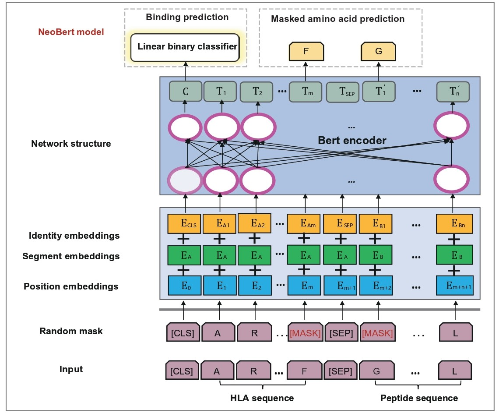

# NeoBert

## NeoAtlas and NeoBert: A Database and A Predictive Model for Canonical and Noncanonical Tumor Neoantigens


## Overview

**Overview of the Magic model**. Accurately predicting epitope and HLA binding remains a critical and challenging task in immunology, which prompted the development of many tools and models such as NetMHCpan. Very few current models took into consideration of noncanonical antigens, but our work thus far has revealed that distinct features exist between canonical and noncanonical neoantigens. Towards this end, we adopted the Bidirectional Encoder Representations from Transformers (BERT) model to predict the binding affinity of neoantigens and HLA, and named our new model NeoBERT. NeoBERT is an advanced model designed specifically for predicting the binding affinity between neoantigens and HLA. It is a variant of the original BERT model, enhanced to integrate biological features with deep learning techniques. Unlike traditional tools, NeoBERT considers both canonical and noncanonical neoantigens, offering unique insights into the binding capabilities of these diverse antigens.

**The framework of the NeoBert model**. Each pair of HLA and peptide sequences is treated as a sentence, with each amino acid represented as a token. The [CLS] token represents the entire sequence, while the [SEP] token separates the HLA and peptide sequences. Random masking is applied to some amino acids in the sequence. For each token, the position embeddings E<sub>i</sub> (corresponding to the token's position in the sequence), segment embeddings E<sub>A</sub> (indicating the token's group), and identity embeddings E<sub>Ai</sub> (derived from the amino acid identity using WordPiece embeddings) are summed and fed into BERT to generate token embeddings. The amino acid predictor infers the identities for the masked amino acids, contributing to the loss function. Simultaneously, the [CLS] representation is passed through a linear classifier to predict the binding affinity of neoantigens and HLA sequences.

## Checkpoint

A pre-trained model checkpoint for Bert can be downloaded from this link. https://huggingface.co/google-bert/bert-base-uncased.

## Installation

### Recommended Installation via Conda Virtual Environment

#### Step 1: Set Up Conda Environment

```bash
# Create virtual environment with Python 3.8
conda create -n NeoBert python=3.12
conda activate NeoBert
```

#### Step 2: Clone Repository & Install Dependencies

```bash
# Clone NeoBert repository
git clone https://github.com/cat-moom/NeoBert.git
cd NeoBert

# Install required Python packages
pip install -r requirements.txt
```

#### Step 3: Download Pre-trained BERT Model

```bash
# Install Git Large File Storage (LFS)
git lfs install

# Download full BERT-base-uncased model
git clone https://huggingface.co/google-bert/bert-base-uncased

# Alternative: Clone without large files (metadata only)
GIT_LFS_SKIP_SMUDGE=1 git clone https://huggingface.co/google-bert/bert-base-uncased
```

## Data preprocessing

If your data is in HLA format, please use the provided HLA_data.csv file to convert the HLA data into the corresponding pseudo format. After conversion, store the HLA-Peptide pairs in a single CSV file. The final saved results should follow the format shown in ./data/data_example.csv or the example format provided below.

| HLA_generate                        | Peptide_generate               | binding |
|-------------------------------------|--------------------------------|---------|
| YYAEYRNIYAQTDESNLYWTYNLYTWAELAYTWY | SPTKPIMSA                      | 1       |
| YYTKYREISTNTYENTAYIRYDDYTWAVDAYLSY | EISGGAMAVVAVFLNNKLYVANVGT      | 1       |
| YYAGYREKYRQADVSNLYLWYDSYTWAEWAYTWY | APSQTLDSNPKVFCCTHSLPIEDPQ      | 1       |
| YYAMYGENMASTYENIAYIVYDSYTWAVLAYLWY | LTM(+15.99)KAALTLEW            | 1       |
| YFAMYQENVAQTDVDTLYIIYRDYTWAELAYTWY | SSNVQVMLK                      | 1       |
| YFAMYQENMAHTDANTLYIIYRDYTWVARVYRGY | KVDPIGHVY                      | 1       |
| YYAEYRNIYAQTDESNLYWTYNLYTWAELAYTWY | LPARAGPGA                      | 1       |

### Step 1: Generate negative samples

Run the following command to move several characters from the end of the MHC sequence to the beginning to generate negative samples for training.

```bash
python process.py
```

### Step 2: Divide the positive and negative samples according to a certain ratio

Use the following command to split the positive samples and their corresponding generated negative samples according to the specified ratio, and then merge them into a new dataset.

```bash
python process_hebing.py
```

### Step 3: Dataset format conversion

Run the following command to convert the CSV file into JSON format, where the text consists of MHC sequence + [SEP] + peptide sequence, and the label indicates whether the two sequences can bind.

```bash
python dataset_to_json.py
```

## Quick start

### Model Training

Before starting the training process, please make sure that the parameters in train.py are configured correctly to initialize the training correctly. Also, please use the correct dataset format for model training.

```bash
python train.py
```

The model will store the top 20 best-performing model weights in the output folder for further analysis and application.

### Inference

We offer two modes for inference: one for processing multiple data entries from a file, and the other for providing specific HLA and peptide sequences.

```bash
python infer.py
```

**Parameter Details:**
--input_mode: Use 0 for file-based input, and 1 for specifying individual HLA and peptide sequences (required).<br> --model_path: Path to load the model weights (required).<br>

#### 1. input_mode: 0

--input_file: Input file in CSV or XLSX format, with the output saved in the same format. Refer to example.xlsx for the format.<br> --save_dir: Directory where prediction results will be stored. The directory will be created if it doesn't exist.<br> 
Example:

```bash
python infer.py --input_mode 0 --model_path ./model_weight/checkpoint/ --save_dir ./predictout/ --input_file ./XXXX.csv
```

#### 2. input_mode: 1

--Peptide: Provide a peptide sequence, for example, EISGGAMAVVAVFLNNKLYVANVGT.<br> --HLA: Provide an HLA sequence, for example, YYTKYREISTNTYENTAYIRYDDYTWAVDAYLSY.<br> 
Example:

```bash
python infer.py --input_mode 1 --model_path ./model_weight/checkpoint/ --Peptide EISGGAMAVVAVFLNNKLYVANVGT --HLA YYTKYREISTNTYENTAYIRYDDYTWAVDAYLSY
```

### Evaluation

Use the following command to calculate Accuracy, F1 score, AUC, and MCC for the test dataset, and save the prediction results in a CSV file.

```bash
python eval.py
```
